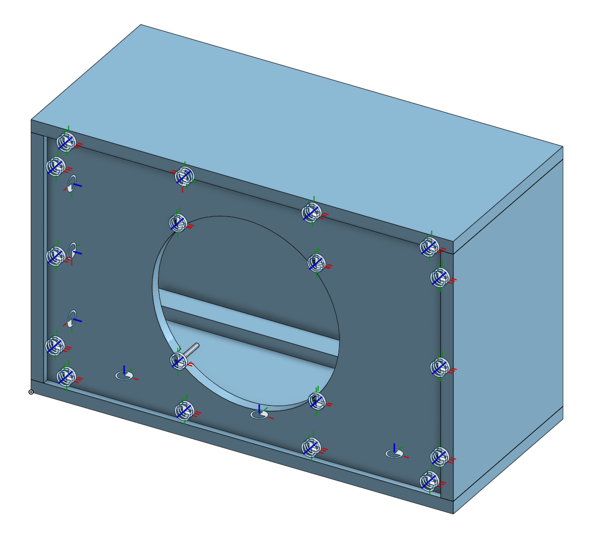

## Bill of Materials

### Wood

- [1] sheet of 5/8" thick plywood. I cut this out of a standard 4' x 8' piece, but only about 2' x 3' is really needed.
- [1] 1"x12"x8' pine, I found this in the shelving section of Lowe's
- [2] 1"x2"x8' furring strips

### Hardware

- [14] #10 x 3" bolts
- [14] #10 nuts + washers
- [4] 1/4-20 x 2" bolts
- [4] 1/4-20 nuts + washers
- [12] 2" deck screws, really any countersunk 2"+ wood screws are fine
- [30ish?] A bunch of ~1" wood screws for attaching the internal bracing and back plate

### Miscellaneous

- [2] handles, I bought [these Reliable Hardware Company ones](https://www.amazon.com/dp/B00JQYVJNS?ref=ppx_yo2ov_dt_b_fed_asin_title)
- [4] rubber feet, any will do but I bought [these](https://www.amazon.com/dp/B00S48P2YY?ref=ppx_yo2ov_dt_b_fed_asin_title)
- Roughly 2' x 15" of grill cloth, I bought [this](https://www.amazon.com/dp/B07F3YS99J?ref=ppx_yo2ov_dt_b_fed_asin_title&th=1)
- [1] 1/4" mono jack, I think I grabbed one out of a broken guitar pedal
- About 2' of insulated wiring to connect the jack and speaker

### (Optional) Stain + Finish

- Wood stain (I used a walnut stain)
- Tung Oil

## Design

There's a ton of design work that _can_ go into building guitar cabinets like is done for Hi-Fi speakers, with things like [Thiele-Small parameters]() and [using the Golden Ratio for the enclosure dimensions](https://www.audiocircle.com/index.php?topic=46637.0). I spent a while looking into all of this, but it seemed like the lo-fi and non-linear nature of guitar speakers means that, at least for a closed-back cabinet that I was looking to build, the dimensions of the cabinet did not matter much.

With that in mind, I still opted to start with a golden ratio design and then work from there to make the cabinet easy to build. I wanted the cabinet to be 25" wide to match the amp head I built previously, and I calculated the other dimensions from there. Setting 25" as the long dimension, this gives dimensions of

- Width: 25"
- Height: 25 / 1.6 = 15.625"
- Depth: 15.625" x 0.6 = 9.375"

Though the 25" measurement was an external one, I wanted to ensure that there was at least 9" of internal depth to give the speaker plenty of room relative to the input jack. This fit well with using a pine 1x12 (actual 3/4" by 11 1/4") for the frame.

Though internal volume is the number that actually makes a difference in the speaker response, it was easy enough to calculate the external volume and use that as a point of comparison to other popular 1x12 extension cabinets. The above specs result in an external volume of 4394 in^3, which is less than the huge closed back 1x12 from Emperor, but also a decent bit larger than the Bogner Cube (although that's ported for additional low end response). A large cabinet might have resulted in a slightly better bass response but again, these things don't seem to make much of a difference for guitar speakers and the midrange focus of electric guitar.

## Assembly Process

- frame
- bracing/mounting points
- baffle/back
- final assembly

## CAD Assembly

For a clearer picture of how the pieces fit together, here's the Onshape CAD assembly for the cabinet:

[CAD assembly in Onshape](https://cad.onshape.com/documents/a8e99d359d06e281134f1993/w/de057f5f0dc9ce846859dc1a/e/7b6bebf37df140934a427da3?configuration=default&renderMode=0&uiState=683f8d0d5b9c4020e70d1d25)

